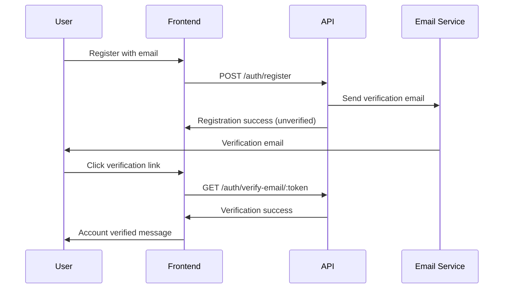

# 📧 **Email Verification**

## 📋 **Overview**

This document covers the email verification system in the GIV Society API, including verification flow, resending verification emails, and handling verification states.

---

## 🔄 **Verification Flow**

### **Registration Flow**


---

## 📧 **Verification Endpoints**

### **GET** `/auth/verify-email/:token`
Verify email address using verification token.

#### **Rate Limit**: 5 attempts per hour per IP

#### **Parameters**
- `token`: Email verification token from email link

#### **Success Response** (200 OK)
```json
{
  "success": true,
  "message": "Email verified successfully",
  "user": {
    "id": "123",
    "email": "user@example.com",
    "email_verified": true,
    "verified_at": "2024-07-07T10:00:00.000Z"
  }
}
```

#### **Error Responses**
```json
// Invalid Token (400)
{
  "success": false,
  "errors": ["Invalid verification token"],
  "code": "INVALID_VERIFICATION_TOKEN"
}

// Expired Token (400)
{
  "success": false,
  "errors": ["Verification token has expired"],
  "code": "TOKEN_EXPIRED",
  "action": "resend_verification"
}

// Already Verified (400)
{
  "success": false,
  "errors": ["Email is already verified"],
  "code": "EMAIL_ALREADY_VERIFIED"
}
```

### **POST** `/auth/resend-verification`
Resend verification email to user.

#### **Authentication**: Required (for logged-in users) or email parameter
#### **Rate Limit**: 5 attempts per hour per IP

#### **Request Body**
```json
{
  "email": "user@example.com"
}
```

#### **Success Response** (200 OK)
```json
{
  "success": true,
  "message": "Verification email sent successfully",
  "email_sent_to": "user@example.com",
  "expires_in": 86400,
  "can_resend_after": "2024-07-07T11:00:00.000Z"
}
```

#### **Error Responses**
```json
// Email Already Verified (400)
{
  "success": false,
  "errors": ["Email is already verified"],
  "code": "EMAIL_ALREADY_VERIFIED"
}

// User Not Found (404)
{
  "success": false,
  "errors": ["User not found"],
  "code": "USER_NOT_FOUND"
}

// Rate Limited (429)
{
  "success": false,
  "errors": ["Too many verification emails sent. Please wait before requesting another."],
  "code": "RATE_LIMIT_EXCEEDED",
  "retryAfter": 3600
}
```

### **GET** `/auth/verification-status`
Check email verification status for authenticated user.

#### **Authentication**: Required

#### **Success Response** (200 OK)
```json
{
  "success": true,
  "verification_status": {
    "email_verified": false,
    "email": "user@example.com",
    "verification_sent_at": "2024-07-07T10:00:00.000Z",
    "verification_expires_at": "2024-07-08T10:00:00.000Z",
    "can_resend": true,
    "resend_available_at": "2024-07-07T11:00:00.000Z"
  }
}
```

---

## 📨 **Email Templates**

### **Verification Email**
```html
Subject: Verify Your GIV Society Account

<!DOCTYPE html>
<html>
<head>
    <meta charset="utf-8">
    <title>Verify Your Email</title>
</head>
<body style="font-family: Arial, sans-serif; max-width: 600px; margin: 0 auto;">
    <div style="background: #f8f9fa; padding: 20px; text-align: center;">
        
    </div>
    
    <div style="padding: 30px 20px;">
        <h1 style="color: #333; margin-bottom: 20px;">Welcome to GIV Society!</h1>
        
        <p style="color: #666; font-size: 16px; line-height: 1.5;">
            Thank you for registering with GIV Society. To complete your registration 
            and start making a difference, please verify your email address.
        </p>
        
        <div style="text-align: center; margin: 30px 0;">
            <a href="[VERIFICATION_URL]" 
               style="background: #007bff; color: white; padding: 12px 30px; 
                      text-decoration: none; border-radius: 5px; display: inline-block;">
                Verify Email Address
            </a>
        </div>
        
        <p style="color: #666; font-size: 14px;">
            If the button doesn't work, copy and paste this link into your browser:
            <br>
            <a href="[VERIFICATION_URL]">[VERIFICATION_URL]</a>
        </p>
        
        <p style="color: #666; font-size: 14px;">
            This verification link will expire in 24 hours for security reasons.
        </p>
        
        <p style="color: #666; font-size: 14px;">
            If you didn't create an account with GIV Society, please ignore this email.
        </p>
    </div>
    
    <div style="background: #f8f9fa; padding: 20px; text-align: center; color: #666; font-size: 12px;">
        <p>© 2024 GIV Society. All rights reserved.</p>
        <p>
            <a href="[UNSUBSCRIBE_URL]">Unsubscribe</a> | 
            <a href="[PRIVACY_URL]">Privacy Policy</a> | 
            <a href="[SUPPORT_URL]">Support</a>
        </p>
    </div>
</body>
</html>
```

### **Verification Success Email**
```html
Subject: Email Verified Successfully

Hello [Name],

Great news! Your email address has been successfully verified.

Your GIV Society account is now fully activated and you can:
✅ Access all platform features
✅ Participate in campaigns and events
✅ Receive important notifications
✅ Connect with the community

[Get Started] [Explore Campaigns]

Welcome to the GIV Society community!

Best regards,
The GIV Society Team
```

---

## 🔧 **Verification Logic**

### **Token Generation**
```javascript
const generateVerificationToken = (userId, email) => {
  const payload = {
    userId: userId.toString(),
    email: email,
    tokenType: 'email_verification',
    purpose: 'verify_email'
  };
  
  return jwt.sign(payload, process.env.JWT_SECRET, {
    expiresIn: '24h',
    issuer: 'giv-society',
    audience: 'giv-society-users'
  });
};
```

### **Verification Process**
```javascript
const verifyEmail = async (token) => {
  try {
    // Verify and decode token
    const decoded = jwt.verify(token, process.env.JWT_SECRET, {
      issuer: 'giv-society',
      audience: 'giv-society-users'
    });
    
    // Check token type
    if (decoded.tokenType !== 'email_verification') {
      throw new Error('Invalid token type');
    }
    
    // Find user
    const user = await prisma.users.findUnique({
      where: { id: parseInt(decoded.userId) }
    });
    
    if (!user) {
      throw new Error('User not found');
    }
    
    // Check if email matches
    if (user.email !== decoded.email) {
      throw new Error('Email mismatch');
    }
    
    // Check if already verified
    if (user.email_verified) {
      throw new Error('Email already verified');
    }
    
    // Update user verification status
    const updatedUser = await prisma.users.update({
      where: { id: user.id },
      data: {
        email_verified: true,
        email_verified_at: new Date()
      }
    });
    
    // Log verification event
    await logSecurityEvent('EMAIL_VERIFIED', {
      userId: user.id,
      email: user.email
    });
    
    // Send welcome email
    await sendWelcomeEmail(user);
    
    return {
      success: true,
      user: updatedUser
    };
    
  } catch (error) {
    if (error.name === 'TokenExpiredError') {
      throw new Error('Verification token has expired');
    } else if (error.name === 'JsonWebTokenError') {
      throw new Error('Invalid verification token');
    } else {
      throw error;
    }
  }
};
```

### **Resend Verification**
```javascript
const resendVerification = async (email) => {
  // Find user
  const user = await prisma.users.findUnique({
    where: { email }
  });
  
  if (!user) {
    // Don't reveal if user exists for security
    return { success: true, message: 'If account exists, email sent' };
  }
  
  if (user.email_verified) {
    throw new Error('Email is already verified');
  }
  
  // Check rate limiting
  const lastSent = await getLastVerificationSent(user.id);
  const cooldownPeriod = 60 * 60 * 1000; // 1 hour
  
  if (lastSent && (Date.now() - lastSent.getTime()) < cooldownPeriod) {
    throw new Error('Please wait before requesting another verification email');
  }
  
  // Generate new token
  const token = generateVerificationToken(user.id, user.email);
  
  // Send verification email
  await sendVerificationEmail(user, token);
  
  // Update last sent timestamp
  await updateLastVerificationSent(user.id);
  
  return {
    success: true,
    message: 'Verification email sent successfully'
  };
};
```

---

## 🔒 **Security Considerations**

### **Token Security**
- **Expiration**: 24-hour token lifetime
- **Single Use**: Tokens invalidated after successful verification
- **Cryptographic**: Secure JWT token generation
- **Rate Limiting**: Prevent spam and abuse

### **Email Security**
- **No User Enumeration**: Don't reveal if email exists
- **Rate Limiting**: Prevent email bombing
- **Link Security**: HTTPS-only verification links
- **Token Validation**: Comprehensive token validation

### **Privacy Protection**
- **Minimal Data**: Only necessary data in tokens
- **Secure Transmission**: HTTPS for all communications
- **Data Retention**: Automatic cleanup of expired tokens

---

## 📱 **Frontend Integration**

### **Verification Component**
```javascript
const EmailVerification = () => {
  const [verificationStatus, setVerificationStatus] = useState(null);
  const [loading, setLoading] = useState(true);
  const [resending, setResending] = useState(false);
  
  useEffect(() => {
    checkVerificationStatus();
  }, []);
  
  const checkVerificationStatus = async () => {
    try {
      const response = await apiRequest('/auth/verification-status');
      setVerificationStatus(response.verification_status);
    } catch (error) {
      console.error('Failed to check verification status:', error);
    } finally {
      setLoading(false);
    }
  };
  
  const resendVerification = async () => {
    setResending(true);
    try {
      await apiRequest('/auth/resend-verification', {
        method: 'POST',
        body: JSON.stringify({
          email: verificationStatus.email
        })
      });
      
      showSuccess('Verification email sent successfully');
      await checkVerificationStatus(); // Refresh status
    } catch (error) {
      showError('Failed to send verification email');
    } finally {
      setResending(false);
    }
  };
  
  if (loading) return <LoadingSpinner />;
  
  if (verificationStatus?.email_verified) {
    return (
      <div className="verification-success">
        <Icon name="check-circle" color="green" />
        <h3>Email Verified</h3>
        <p>Your email address has been verified successfully.</p>
      </div>
    );
  }
  
  return (
    <div className="verification-pending">
      <Icon name="mail" color="orange" />
      <h3>Email Verification Required</h3>
      <p>
        We've sent a verification email to <strong>{verificationStatus?.email}</strong>.
        Please check your inbox and click the verification link.
      </p>
      
      <div className="verification-actions">
        <button 
          onClick={resendVerification}
          disabled={resending || !verificationStatus?.can_resend}
          className="btn-primary"
        >
          {resending ? 'Sending...' : 'Resend Verification Email'}
        </button>
        
        <button onClick={checkVerificationStatus} className="btn-outline">
          Check Status
        </button>
      </div>
      
      {!verificationStatus?.can_resend && (
        <p className="text-muted">
          You can request another verification email at{' '}
          {formatTime(verificationStatus?.resend_available_at)}
        </p>
      )}
    </div>
  );
};
```

### **Verification Page**
```javascript
const VerifyEmailPage = () => {
  const [verifying, setVerifying] = useState(true);
  const [result, setResult] = useState(null);
  const { token } = useParams();
  
  useEffect(() => {
    verifyEmail();
  }, [token]);
  
  const verifyEmail = async () => {
    try {
      const response = await fetch(`/api/v1/auth/verify-email/${token}`);
      const data = await response.json();
      
      setResult(data);
    } catch (error) {
      setResult({
        success: false,
        errors: ['Verification failed']
      });
    } finally {
      setVerifying(false);
    }
  };
  
  if (verifying) {
    return (
      <div className="verification-loading">
        <LoadingSpinner />
        <p>Verifying your email address...</p>
      </div>
    );
  }
  
  if (result?.success) {
    return (
      <div className="verification-success">
        <Icon name="check-circle" size="large" color="green" />
        <h1>Email Verified Successfully!</h1>
        <p>Your account is now fully activated.</p>
        <Link to="/dashboard" className="btn-primary">
          Go to Dashboard
        </Link>
      </div>
    );
  }
  
  return (
    <div className="verification-error">
      <Icon name="x-circle" size="large" color="red" />
      <h1>Verification Failed</h1>
      <p>{result?.errors?.[0] || 'Unknown error occurred'}</p>
      
      {result?.code === 'TOKEN_EXPIRED' && (
        <Link to="/resend-verification" className="btn-primary">
          Request New Verification Email
        </Link>
      )}
      
      <Link to="/login" className="btn-outline">
        Back to Login
      </Link>
    </div>
  );
};
```

---

## 📊 **Verification Analytics**

### **Verification Metrics**
```json
{
  "verification_stats": {
    "total_users": 10000,
    "verified_users": 8500,
    "verification_rate": 85.0,
    "pending_verifications": 1500,
    "verification_emails_sent_24h": 234,
    "successful_verifications_24h": 189,
    "expired_tokens_24h": 45,
    "average_verification_time": 1800
  }
}
```

---

**Previous**: [Sessions Management](./sessions.md)  
**Next**: [Email Templates](./email-templates.md)
