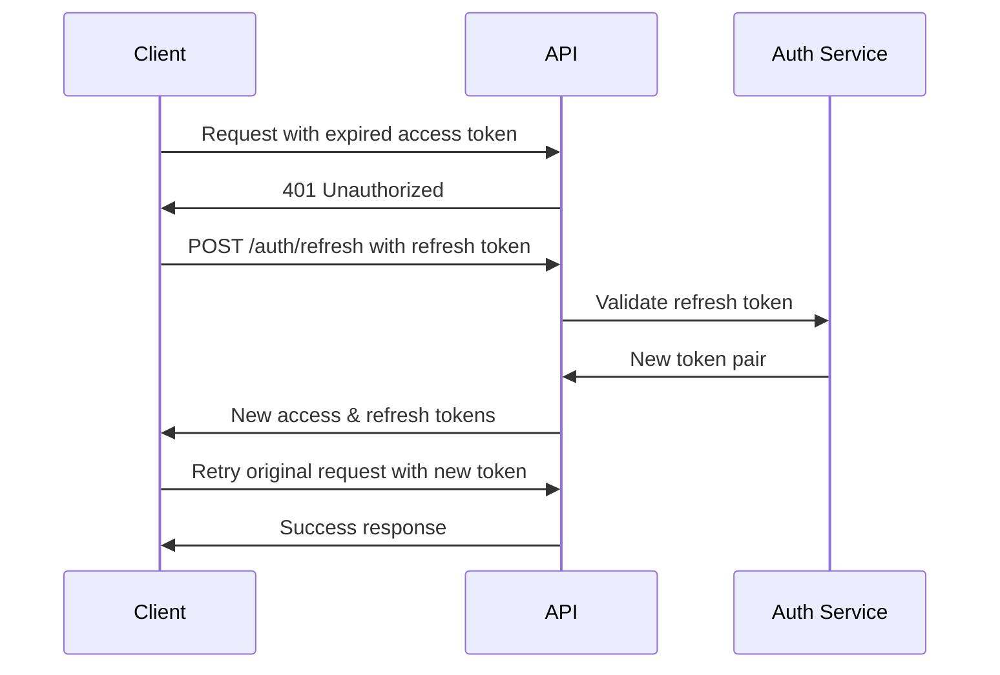

# 🎫 **JWT Tokens**

## 📋 **Overview**

This document covers JWT (JSON Web Token) implementation, token structure, expiration, refresh mechanisms, and security considerations in the GIV Society API.

---

## 🔑 **Token Types**

### **Access Token**
- **Purpose**: API authentication and authorization
- **Expiration**: 15 minutes
- **Storage**: Memory/state (frontend)
- **Usage**: Bearer token in Authorization header

### **Refresh Token**
- **Purpose**: Generate new access tokens
- **Expiration**: 7 days
- **Storage**: HTTP-only cookie (secure)
- **Usage**: Token refresh endpoint

### **Password Reset Token**
- **Purpose**: Password reset verification
- **Expiration**: 10 minutes
- **Storage**: Email link parameter
- **Usage**: One-time password reset

### **Email Verification Token**
- **Purpose**: Email address verification
- **Expiration**: 24 hours
- **Storage**: Email link parameter
- **Usage**: One-time email verification

---

## 🏗️ **Token Structure**

### **Access Token Payload**
```json
{
  "userId": "123",
  "email": "user@example.com",
  "role": "volunteer",
  "sessionId": "sess_1234567890abcdef",
  "iat": 1625097600,
  "exp": 1625098500,
  "iss": "giv-society",
  "aud": "giv-society-users"
}
```

### **Refresh Token Payload**
```json
{
  "userId": "123",
  "sessionId": "sess_1234567890abcdef",
  "tokenType": "refresh",
  "iat": 1625097600,
  "exp": 1625702400,
  "iss": "giv-society",
  "aud": "giv-society-users"
}
```

### **Password Reset Token Payload**
```json
{
  "userId": "123",
  "email": "user@example.com",
  "tokenType": "password_reset",
  "iat": 1625097600,
  "exp": 1625098200,
  "iss": "giv-society",
  "aud": "giv-society-users"
}
```

### **Email Verification Token Payload**
```json
{
  "userId": "123",
  "email": "user@example.com",
  "tokenType": "email_verification",
  "iat": 1625097600,
  "exp": 1625184000,
  "iss": "giv-society",
  "aud": "giv-society-users"
}
```

---

## ⏰ **Token Expiration**

### **Expiration Times**
```javascript
const TOKEN_EXPIRATION = {
  ACCESS: 15 * 60,        // 15 minutes
  REFRESH: 7 * 24 * 60 * 60, // 7 days
  RESET: 10 * 60,         // 10 minutes
  VERIFY: 24 * 60 * 60    // 24 hours
};
```

### **Expiration Handling**
- **Access Token**: Automatic refresh on 401 response
- **Refresh Token**: Manual refresh required after expiration
- **Reset Token**: Single use, expires after use or timeout
- **Verification Token**: Single use, expires after use or timeout

---

## 🔄 **Token Refresh Flow**

### **Automatic Refresh Process**


### **Refresh Token Endpoint**
```javascript
// POST /auth/refresh
{
  "refresh_token": "eyJhbGciOiJIUzI1NiIsInR5cCI6IkpXVCJ9..."
}

// Response
{
  "success": true,
  "tokens": {
    "accessToken": "eyJhbGciOiJIUzI1NiIsInR5cCI6IkpXVCJ9...",
    "refreshToken": "eyJhbGciOiJIUzI1NiIsInR5cCI6IkpXVCJ9...",
    "expiresIn": 900
  }
}
```

---

## 🔒 **Token Security**

### **Signing Algorithm**
- **Algorithm**: HMAC SHA-256 (HS256)
- **Secret**: Environment variable `JWT_SECRET`
- **Key Rotation**: Planned for future implementation

### **Token Validation**
```javascript
const validateToken = (token, audience) => {
  try {
    const decoded = jwt.verify(token, process.env.JWT_SECRET, {
      issuer: 'giv-society',
      audience: audience,
      algorithms: ['HS256']
    });
    
    return { valid: true, payload: decoded };
  } catch (error) {
    return { valid: false, error: error.message };
  }
};
```

### **Token Blacklisting**
- **Revoked Tokens**: Stored in database with expiration
- **Logout**: Blacklists current access token
- **Password Change**: Blacklists all user tokens
- **Account Deletion**: Blacklists all user tokens

---

## 📱 **Frontend Token Management**

### **Token Storage Strategy**
```javascript
class TokenManager {
  constructor() {
    this.accessToken = null;
    this.refreshToken = null; // Stored in HTTP-only cookie
    this.refreshPromise = null;
  }
  
  setTokens(accessToken, refreshToken) {
    this.accessToken = accessToken;
    // Refresh token is set as HTTP-only cookie by server
  }
  
  getAccessToken() {
    return this.accessToken;
  }
  
  async refreshTokens() {
    // Prevent multiple simultaneous refresh requests
    if (this.refreshPromise) {
      return this.refreshPromise;
    }
    
    this.refreshPromise = this.performRefresh();
    
    try {
      const result = await this.refreshPromise;
      this.refreshPromise = null;
      return result;
    } catch (error) {
      this.refreshPromise = null;
      throw error;
    }
  }
  
  async performRefresh() {
    const response = await fetch('/api/v1/auth/refresh', {
      method: 'POST',
      credentials: 'include' // Include HTTP-only cookies
    });
    
    if (response.ok) {
      const data = await response.json();
      this.setTokens(data.tokens.accessToken);
      return data.tokens;
    } else {
      throw new Error('Token refresh failed');
    }
  }
  
  clearTokens() {
    this.accessToken = null;
    // Refresh token cleared by server on logout
  }
}
```

### **Automatic Token Refresh**
```javascript
const apiRequest = async (url, options = {}) => {
  const makeRequest = async (token) => {
    return fetch(url, {
      ...options,
      headers: {
        'Authorization': `Bearer ${token}`,
        'Content-Type': 'application/json',
        ...options.headers
      },
      credentials: 'include'
    });
  };
  
  // Try with current access token
  let response = await makeRequest(tokenManager.getAccessToken());
  
  // If token expired, refresh and retry
  if (response.status === 401) {
    try {
      const newTokens = await tokenManager.refreshTokens();
      response = await makeRequest(newTokens.accessToken);
    } catch (refreshError) {
      // Refresh failed, redirect to login
      window.location.href = '/login';
      throw new Error('Authentication failed');
    }
  }
  
  return response;
};
```

---

## 🔍 **Token Validation Middleware**

### **Authentication Middleware**
```javascript
const authenticateToken = async (req, res, next) => {
  try {
    const authHeader = req.headers.authorization;
    const token = extractTokenFromHeader(authHeader);
    
    if (!token) {
      return res.status(401).json({
        success: false,
        message: 'Access token is required',
        code: 'MISSING_TOKEN'
      });
    }
    
    // Check if token is blacklisted
    if (await isAccessTokenRevoked(token)) {
      return res.status(401).json({
        success: false,
        message: 'Token has been revoked',
        code: 'TOKEN_REVOKED'
      });
    }
    
    // Verify token
    const decoded = verifyToken(token, 'giv-society-users');
    
    // Attach user to request
    req.user = await getUserFromToken(decoded);
    
    next();
  } catch (error) {
    if (error.message === 'Token has expired') {
      return res.status(401).json({
        success: false,
        message: 'Token has expired',
        code: 'TOKEN_EXPIRED'
      });
    }
    
    return res.status(401).json({
      success: false,
      message: 'Invalid token',
      code: 'INVALID_TOKEN'
    });
  }
};
```

---

## 🛠️ **Token Utilities**

### **Token Generation**
```javascript
const generateTokenPair = (user) => {
  const sessionId = generateSessionId();
  
  const accessTokenPayload = {
    userId: user.id.toString(),
    email: user.email,
    role: user.role,
    sessionId
  };
  
  const refreshTokenPayload = {
    userId: user.id.toString(),
    sessionId,
    tokenType: 'refresh'
  };
  
  const accessToken = jwt.sign(accessTokenPayload, process.env.JWT_SECRET, {
    expiresIn: TOKEN_EXPIRATION.ACCESS,
    issuer: 'giv-society',
    audience: 'giv-society-users'
  });
  
  const refreshToken = jwt.sign(refreshTokenPayload, process.env.JWT_REFRESH_SECRET, {
    expiresIn: TOKEN_EXPIRATION.REFRESH,
    issuer: 'giv-society',
    audience: 'giv-society-users'
  });
  
  return {
    accessToken,
    refreshToken,
    expiresIn: TOKEN_EXPIRATION.ACCESS,
    sessionId
  };
};
```

### **Token Extraction**
```javascript
const extractTokenFromHeader = (authHeader) => {
  if (!authHeader) return null;
  
  const parts = authHeader.split(' ');
  if (parts.length !== 2 || parts[0] !== 'Bearer') {
    return null;
  }
  
  return parts[1];
};
```

### **Token Verification**
```javascript
const verifyToken = (token, audience) => {
  try {
    return jwt.verify(token, process.env.JWT_SECRET, {
      issuer: 'giv-society',
      audience: audience,
      algorithms: ['HS256']
    });
  } catch (error) {
    if (error.name === 'TokenExpiredError') {
      throw new Error('Token has expired');
    } else if (error.name === 'JsonWebTokenError') {
      throw new Error('Invalid token');
    } else {
      throw new Error('Token verification failed');
    }
  }
};
```

---

## 🔧 **Configuration**

### **Environment Variables**
```env
# JWT Configuration
JWT_SECRET=your-super-secret-jwt-key-min-32-chars
JWT_REFRESH_SECRET=your-refresh-token-secret-min-32-chars

# Token Expiration (in seconds)
JWT_ACCESS_EXPIRATION=900
JWT_REFRESH_EXPIRATION=604800
JWT_RESET_EXPIRATION=600
JWT_VERIFY_EXPIRATION=86400

# JWT Options
JWT_ISSUER=giv-society
JWT_AUDIENCE=giv-society-users
JWT_ALGORITHM=HS256
```

### **Security Considerations**
- **Secret Management**: Use strong, random secrets (minimum 32 characters)
- **Secret Rotation**: Plan for periodic secret rotation
- **Algorithm Security**: Use only secure algorithms (HS256, RS256)
- **Token Storage**: Never store tokens in localStorage in production
- **HTTPS Only**: Always use HTTPS in production

---

## 📊 **Token Monitoring**

### **Token Metrics**
- Token generation rate
- Token refresh frequency
- Token expiration events
- Invalid token attempts
- Blacklisted token usage

### **Token Analytics**
```json
{
  "token_stats": {
    "tokens_generated_24h": 1247,
    "tokens_refreshed_24h": 8934,
    "tokens_expired_24h": 1156,
    "invalid_token_attempts_24h": 45,
    "blacklisted_token_usage_24h": 12
  },
  "session_stats": {
    "active_sessions": 1247,
    "average_session_duration": 3600,
    "sessions_created_24h": 234,
    "sessions_terminated_24h": 189
  }
}
```

---

## 🚨 **Common Token Errors**

### **Token Expired (401)**
```json
{
  "success": false,
  "message": "Token has expired",
  "code": "TOKEN_EXPIRED",
  "action": "refresh_token"
}
```

### **Invalid Token (401)**
```json
{
  "success": false,
  "message": "Invalid token",
  "code": "INVALID_TOKEN",
  "action": "login_required"
}
```

### **Token Revoked (401)**
```json
{
  "success": false,
  "message": "Token has been revoked",
  "code": "TOKEN_REVOKED",
  "action": "login_required"
}
```

### **Missing Token (401)**
```json
{
  "success": false,
  "message": "Access token is required",
  "code": "MISSING_TOKEN",
  "action": "provide_token"
}
```

---

**Previous**: [Security Features](./security.md)  
**Next**: [Sessions Management](./sessions.md)
