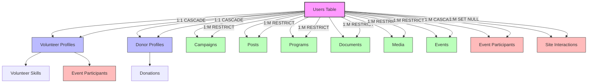
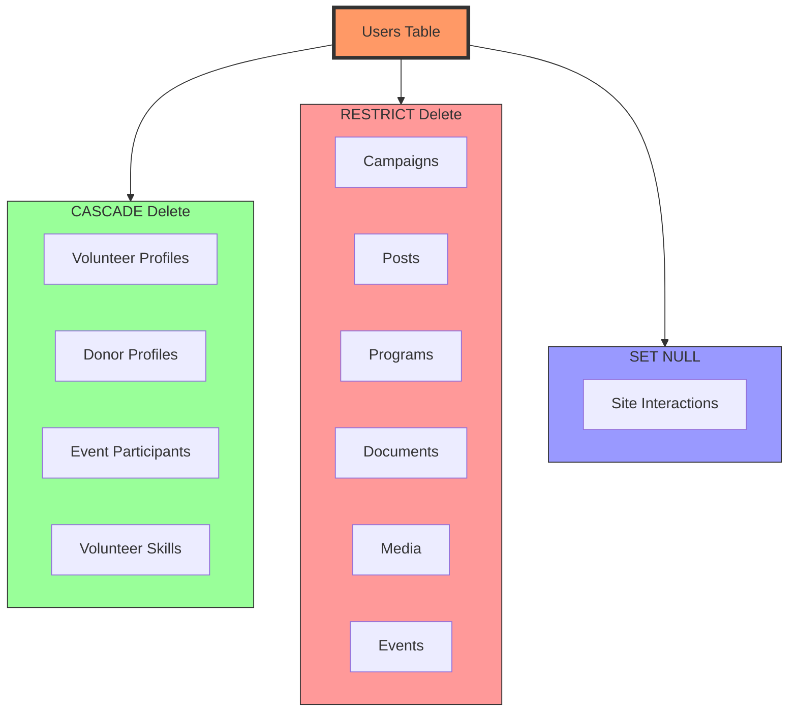

# User Table Dependencies and Relationships

## Core User Table Structure

```sql
CREATE TABLE users (
    id BIGINT UNSIGNED AUTO_INCREMENT PRIMARY KEY,
    full_name VARCHAR(100) NOT NULL,
    email VARCHAR(255) NOT NULL UNIQUE,
    phone VARCHAR(20),
    password_hash VARCHAR(255) NOT NULL,
    role ENUM('admin', 'volunteer', 'donor', 'editor') NOT NULL,
    profile_image_url VARCHAR(512),
    language_preference ENUM('en', 'am') DEFAULT 'en',
    email_verified BOOLEAN DEFAULT FALSE,
    created_at TIMESTAMP DEFAULT CURRENT_TIMESTAMP,
    updated_at TIMESTAMP DEFAULT CURRENT_TIMESTAMP,
    deleted_at TIMESTAMP NULL
);
```

## Direct Profile Extensions

These tables have a one-to-one relationship with users and extend the user's profile based on their role:

1. **Volunteer Profiles**
   - Relationship: One-to-One
   - Foreign Key: `user_id REFERENCES users(id)`
   - Deletion: CASCADE (profile is deleted when user is deleted)
   - Purpose: Stores volunteer-specific information

2. **Donor Profiles**
   - Relationship: One-to-One
   - Foreign Key: `user_id REFERENCES users(id)`
   - Deletion: CASCADE (profile is deleted when user is deleted)
   - Purpose: Stores donor-specific information

## Content Creation Dependencies

Tables where users are content creators/owners:

1. **Campaigns**
   - Relationship: One-to-Many
   - Foreign Key: `created_by REFERENCES users(id)`
   - Deletion: RESTRICT (prevents user deletion if they have campaigns)
   - Purpose: Tracks campaign creators

2. **Posts**
   - Relationship: One-to-Many
   - Foreign Key: `author_id REFERENCES users(id)`
   - Deletion: RESTRICT
   - Purpose: Tracks post authors

3. **Programs**
   - Relationship: One-to-Many
   - Foreign Key: `created_by REFERENCES users(id)`
   - Deletion: RESTRICT
   - Purpose: Tracks program creators

4. **Documents**
   - Relationship: One-to-Many
   - Foreign Key: `uploaded_by REFERENCES users(id)`
   - Deletion: RESTRICT
   - Purpose: Tracks document uploaders

5. **Media**
   - Relationship: One-to-Many
   - Foreign Key: `uploaded_by REFERENCES users(id)`
   - Deletion: RESTRICT
   - Purpose: Tracks media uploaders

## Event Management

Event-related dependencies:

1. **Events**
   - Relationship: One-to-Many
   - Foreign Key: `created_by REFERENCES users(id)`
   - Deletion: RESTRICT
   - Purpose: Tracks event creators

2. **Event Participants**
   - Relationship: Many-to-Many
   - Foreign Key: `user_id REFERENCES users(id)`
   - Deletion: CASCADE
   - Purpose: Tracks event participation
   - Additional Info: Includes role (volunteer, attendee, organizer)

## Skills and Volunteering

Skill-related dependencies:

1. **Volunteer Skills** (through volunteer_profiles)
   - Relationship: Many-to-Many
   - Foreign Key Chain:
     - `volunteer_id REFERENCES volunteer_profiles(user_id)`
     - `volunteer_profiles.user_id REFERENCES users(id)`
   - Deletion: CASCADE
   - Purpose: Tracks volunteer skills and proficiency

## Activity Tracking

System tracking dependencies:

1. **Site Interactions**
   - Relationship: One-to-Many
   - Foreign Key: `user_id REFERENCES users(id)`
   - Deletion: SET NULL
   - Purpose: Tracks user activities and interactions
   - Note: Preserves interaction records even after user deletion

## Deletion Behaviors Summary

The system implements different deletion strategies based on the relationship type:

1. **CASCADE Delete**
   - Volunteer Profiles
   - Donor Profiles
   - Event Participants
   - Volunteer Skills
   - Purpose: Removes all personal/profile data when a user is deleted

2. **RESTRICT Delete**
   - Campaigns
   - Posts
   - Programs
   - Documents
   - Media
   - Events
   - Purpose: Prevents deletion of users who have created content

3. **SET NULL**
   - Site Interactions
   - Purpose: Preserves activity records while anonymizing user data

## Data Integrity Rules

1. Email must be unique
2. Role must be one of: admin, volunteer, donor, editor
3. Language preference must be either 'en' or 'am'
4. Soft deletion supported through deleted_at timestamp
5. Automatic timestamp management for created_at and updated_at

## Security Considerations

1. Passwords are stored as hashes
2. Email verification tracking
3. Role-based access control
4. Profile image URLs limited to 512 characters
5. Phone numbers optional but validated when provided

## Visual Representation

### User Dependencies and Relationships



### Deletion Behaviors



## Legend

### Relationship Types

- **1:1**: One-to-One relationship
- **1:M**: One-to-Many relationship
- **M:M**: Many-to-Many relationship

### Color Coding

- **Pink**: Core User Table
- **Light Blue**: Profile Extensions
- **Light Green**: Content Tables
- **Light Red**: Activity Tables

### Deletion Behaviors

- **CASCADE**: Automatically deletes related records
- **RESTRICT**: Prevents user deletion if related records exist
- **SET NULL**: Sets foreign key to NULL when user is deleted
